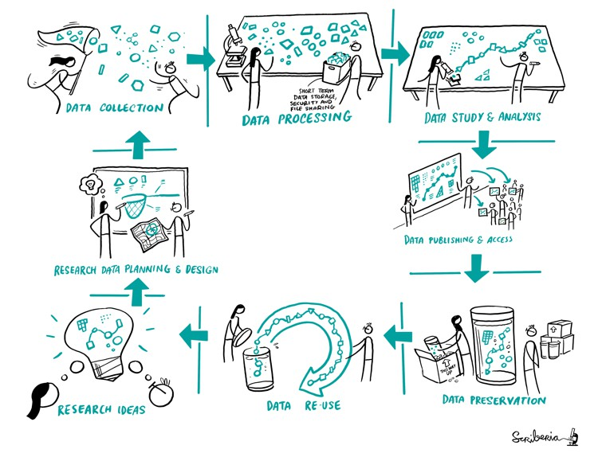
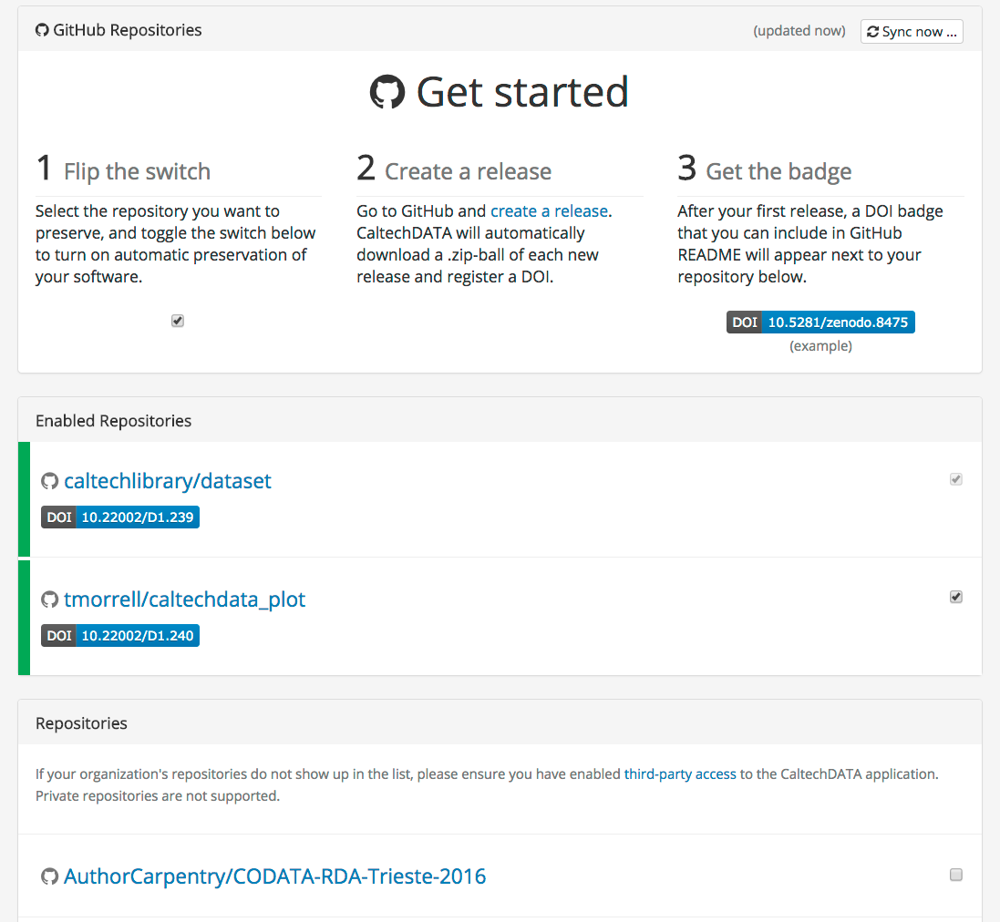

```{r setup, include=FALSE}
knitr::opts_chunk$set(echo = FALSE)
# Learn more about creating blogs with Distill at:
# https://rstudio.github.io/distill/blog.html
```

Although there are overwhelming resources about licensing and citation for R software packages, there's less attention paid to making non-package (data science) code in R citable. Academics and researchers who want to embrace Open Science practices are mostly unaware of how to make their R code citable before publishing in academic journals and what kind of license they may use to protect the intellectual property of their work.

## Why make our computational analysis citable?

Books and published journal articles have always been supplemented with DOIs (digital object identifiers), a key element in the process of research and academic discourse but there's less attention paid to unpublished computational analysis, which is usually abandoned in GitHub (or in someone's else hard drive).



As a researcher, we often spend long time planning and designing our project, collecting and processing data but we often can't publish all the results and analysis if it deemed uninteresting to the journal reviewers.


<aside>

Read More about how to apply open science practices in your data science projects from *The Turing Way* [Book](https://the-turing-way.netlify.app/).

</aside>

As a researcher, if I find an interesting analysis in a GitHub repository (which I always do), I can't cite it as:

> From <https://github.com/BatoolMM/MetagenomicsAnalysis>

This is because the repository is inconsistent changes, the URL is unstable, and there's no metadata (e.g. author, date, ...) associated with the repository. Therefore, it's best practice to generate a DOI and attach a metadata plus a license to the repository to generate a citation similar to:

> Batool Almarzouq. (2021, June). Metagenomic analysis to the soil in Saudi Arabia. Zenodo. <http://doi.org/10.5281/zenodo.4942110>

## What is a DOI?

A digital object identifier (DOI) is a persistent identifier or a unique ID to permanently identify a data, a software, an article or document and link to it on the web. These DOI are designed so your DOI links don't break when a website gets updated.


DOIs are generated by publishing organizations or open-access repositories such as [Zenodo](https://zenodo.org/). Zenodo is a general-purpose open-access repository developed under the European OpenAIRE program and operated by CERN. The previous citation was produced by Zenodo. "Zenodo helps researchers receive credit by making the research results citable. Citation information is also passed to DataCite and onto the scholarly aggregators" [^1].

[^1]: Find out more about Zenodo from [their Website](https://about.zenodo.org/).


## How can we create DOI for our R code?

### 1- Create a license

I can't stress how important to create a license to any project you initiate. The license outline how other researchers can use your data or analysis. Without a license, the code is unusable by others, even if it has been publicly posted on GitHub. Adding a license to any R project is made extremely easy with `usethis` package. Most package developers are familiar with `usethis` package, which can also be extremely useful for non-package projects. You can add any license using a single line:

```{r include=FALSE}
library(usethis)
```

```{r echo=TRUE, warning=TRUE}
use_mit_license("My Name")
#> ✓ Setting License field in DESCRIPTION to 'MIT + file LICENSE'
#> ✓ Writing 'LICENSE'
#> ✓ Writing 'LICENSE.md'
#> ✓ Adding '^LICENSE\\.md$' to '.Rbuildignore'
```

There are many types of licenses but it is not the main focus of this article. You can read more about them from the [Open Source Initiative](https://opensource.org/licenses/category).

### 2- Use git or version control in your analysis

It is best practice to use git or a type of version control when doing any kind of computational analysis. A version control system (VCS) allows you to track the iterative changes you make to your code or project. If you are not familiar with git or its one online hosting site, GitHub (<https://github.com>), I'd recommend that you go through [this carpentry lesson](https://swcarpentry.github.io/git-novice/) which introduce git to novice coders.

Again there's is an abundant resources and tools to use git within R, one of which is `usethis` package. You can read more about it [here](https://usethis.r-lib.org/articles/articles/usethis-setup.html).


### 3- Link your R code to Zenodo

This is the step where you generate the DOI. You can use `Zen4R` to create the DOI from R/RStudio. This package was created by [Emmanuel Blondel](https://github.com/eblondel), which provides an interface to the Zenodo e-infrastructure API. The required steps are explained in [this wiki](https://github.com/eblondel/zen4R/wiki) but you can also do the same thing from Zenodo itself. You start by logging in to Zenodo with your GitHub, then creating a release to your GitHub repository.



In three simple steps within Zenodo, you can link GitHub and generate a DOI. A very good tutorial by the Carpentry is available [here](https://caltechlibrary.github.io/git-desktop/09-preservation/).

### 4- Make your DOI visible in your README file

Add your citation to `CITATION.md` or `README.md` in your github repository. You can also copy a badge from Zenodo with DOI to your `README.md`. Either way, you must add the DOI to the GitHub repository.

**This way, your research outputs can be indexed, cited, and tracked, giving certainty to your scientific work.**

## Acknowledgments {.appendix}

This article was inspired by a talk about Open Data from [Esther Plomp](https://orcid.org/0000-0003-3625-1357) in the [Open Life Science Program](https://openlifesci.org/) Cohort 3. This is a link to the talk in [YouTube](https://www.youtube.com/watch?v=qjsLA1jhK6c&list=PL1CvC6Ez54KDvJbbdLn5rPvf1kInifEh9&index=9) with captions.
